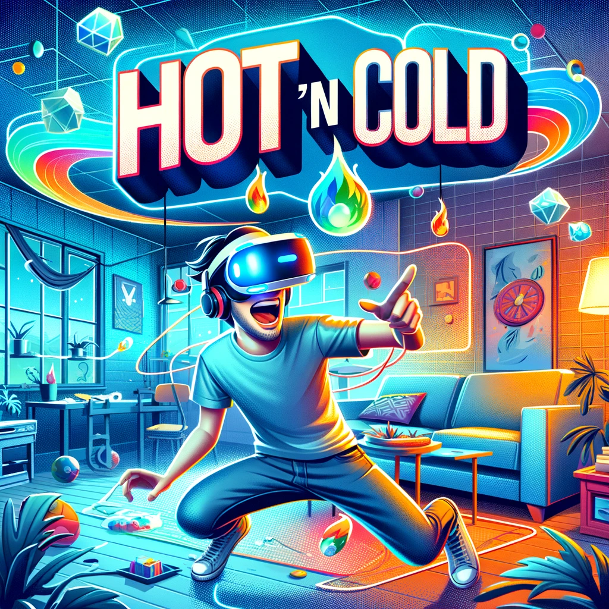
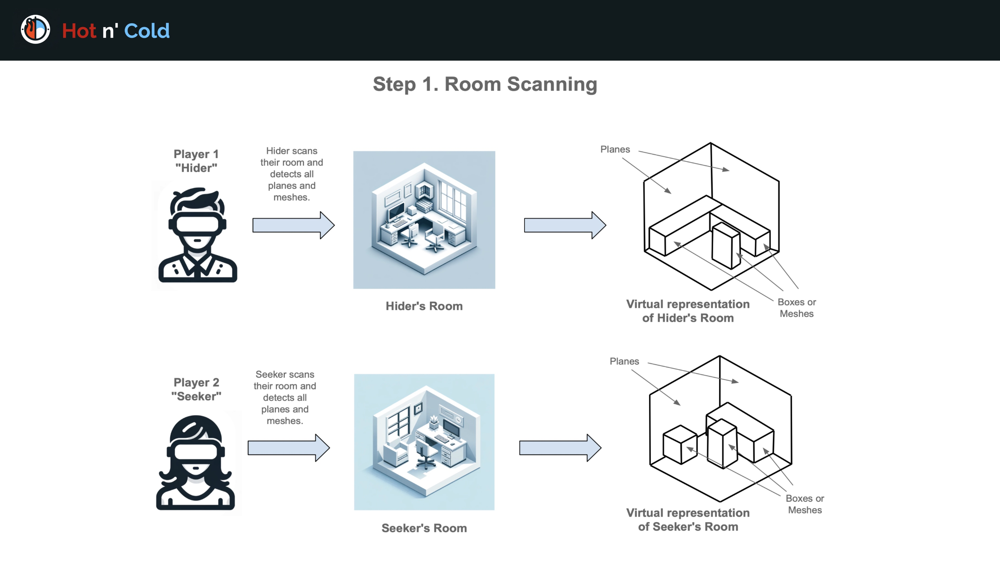
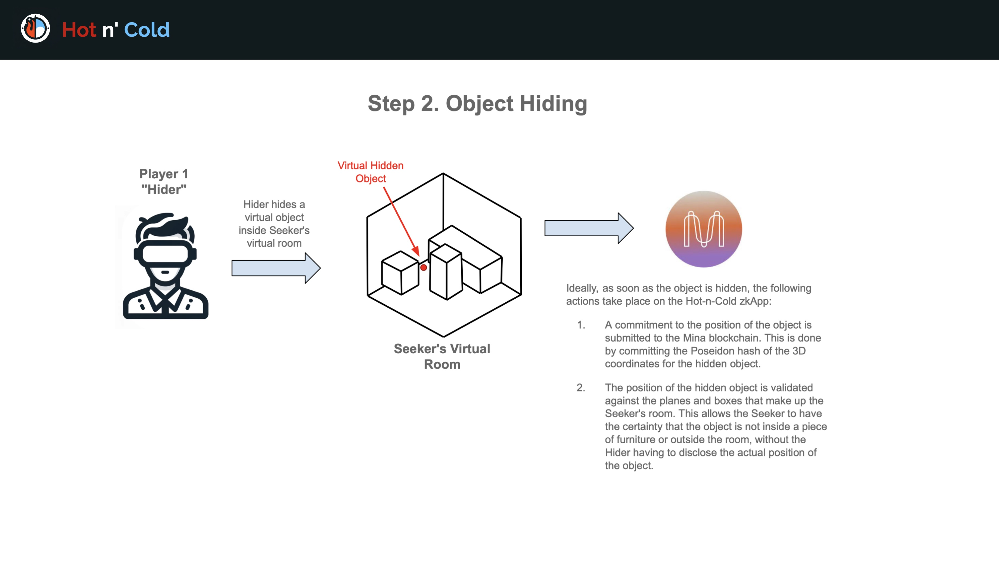

# Hot 'n Cold

## Features

- **Hide and Seek, but Cooler**: Ever dreamed of hiding something in your friend's room from across the globe? With **Hot 'n Cold**, you can! Hide virtual objects in each other's rooms and race to see who finds them first.
- **Blockchain Magic with Mina**: We use Mina's blockchain to make sure the game is fair. No cheating by hiding objects in furniture!
- **User Management System**: We've got this neat system where you can sign up, make friends, and invite them over for a virtual game, all thanks to [Clerk](https://clerk.com/).

## Gameplay

1. **Room Scanning**: Each player uses their Meta Quest 3 headset to scan their room. The advanced depth sensor maps out the space, creating an accurate virtual representation.

   

2. **Hiding the Object**: Players select a virtual object and hide it in their opponent's virtual room. It's a game of wits and strategy - where will you hide your object?

   

3. **The Search Begins**: In a dark virtual version of your room, use your virtual flashlight to find the hidden object. The first to find it wins!

   

### Account Creation and Invitations

- Players can create an account using their email, GitHub, or Discord.
- Inviting a friend is easy. Start a new game and let the fun begin!

  

### Join the Fun

**Hot 'n Cold** offers a unique XR experience, blending the real and virtual worlds. Are you prepared to search in the dark?

Head to [https://zkarcade.vixuslabs.com](https://zkarcade.vixuslabs.com)
